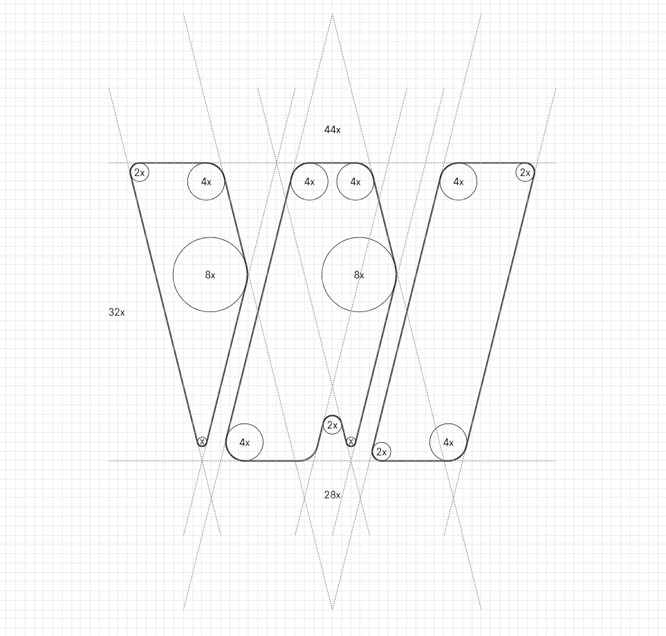

# VI手册

#   1. 名称、书写、介绍
Waddle 是 CoCo 自定义控件图形化编辑器 名称中文意思为“摇摇摆摆地走; (鸭子似地)蹒跚行走，摇摆地行走;”，与 CoCo编辑器 产品经理 CoCo鸭 的名称形成呼应 首字母W与自定义控件（Widget）呼应

**名称正确用法：单词首字母大写，“Waddle”与“编辑器”之间不加空格，名称可以缩写成 Waddle**

- 自定义控件可以使用图形化编程工具 Waddle 制作。
- 自定义控件可以使用图形化编程工具 Waddle编辑器 制作。

**名称错误用法：**

- 自定义控件可以使用图形化编程工具 WaDDle 制作。
- 自定义控件可以使用图形化编程工具 Waddle 编辑器 制作。

**编辑器介绍规范** 完整版： Waddle 是由 CoCo中控台 基于 Blockly 开发的 CoCo自定义控件 图形化编辑器 缩减版： Waddle 是 CoCo 自定义控件图形化编辑器

#   2. Logo
Waddle 的 Logo 以其名的首字母“W”为灵感，将“W”分为三段。 

