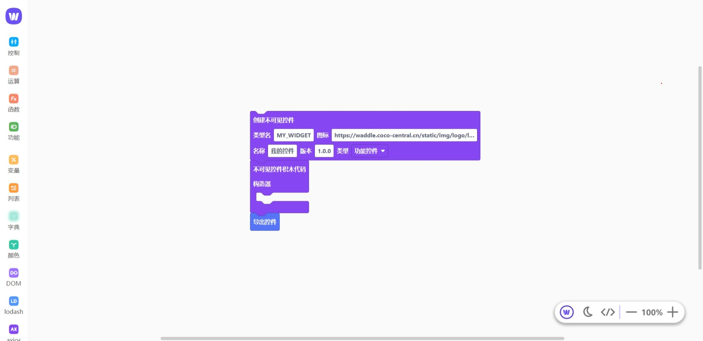
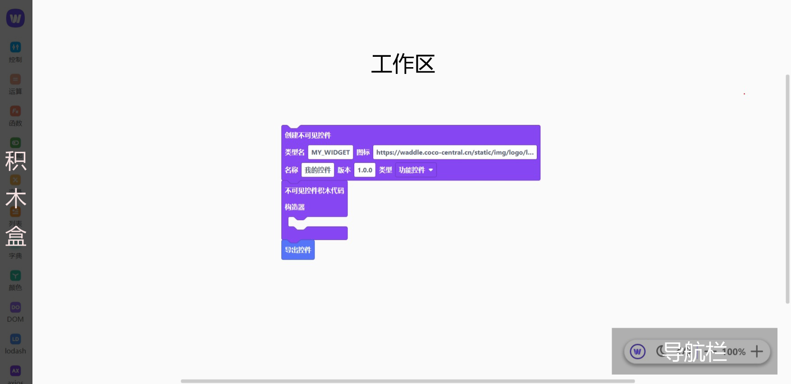
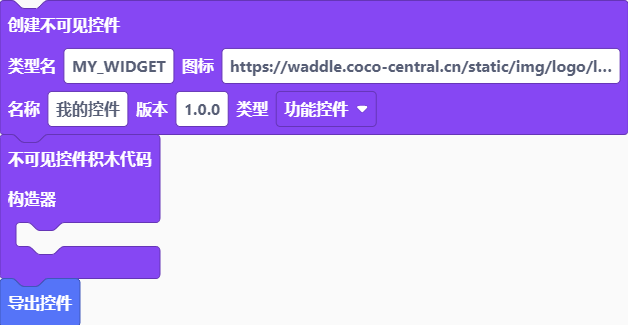
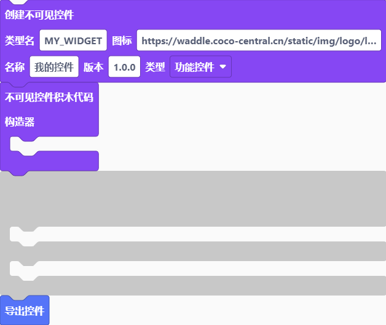
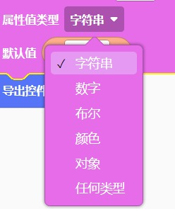

# 使用手册

欢迎来到 Waddle 使用手册， 在这里，你将学习到如何使用 Waddle 做出一个有模有样的 CoCo 控件。

## 前言

非常感谢您阅读此手册，在开始前，请先看这里：

1. 本手册默认您有 CoCo/Kitten 基础

2. 由于部分控件尚未开发完毕，本手册后续跟进更新

3. 若您对此手册的任何地方有疑问，请在 Waddle 交流群（QQ:327827621）中友善提问

CoCo 编辑器已开放了自定义控件功能，开发者可以使用 js 编写属于自己的控件，实现特定的功能。

把控件提交给官方，通过审核后，还可以上架到 “控件商城”

现在，打开 [Waddle 编辑器](https://waddle.coco-central.cn/) ，开启你的自定义控件之旅吧~

当你成功进入 Waddle 之后，应该能看到这样的画面：



Waddle 编辑器整体分为积木盒、工作区和导航栏三部分：



左上角 Waddle 图标可以点击，会出现弹出式菜单：


- 新建控件： 从模板创建一个新控件

- 保存到电脑： 生成一个 `.waddle` 文件，保存到电脑里

- 打开本地文件： 打开电脑里的 `.waddle` 文件

- 导出为 CoCo 文件： 编写完成，生成 `.js`/`.jsx` 文件导入到 CoCo

- 文档： 打开本文档

- 关于 Waddle：查阅版本号等相关信息

# 目录

1. [起步](#起步)

2. [构造](#构造)

3. [积木](#积木)

## 起步

自定义控件有两种类型：

- 不可见控件 (InvisibleWidget)

  这类控件在舞台不可见，一般用于提供系统（原生）能力，比如定时器、Base 编解码等。

  文件格式为 `.js` 比如 `base.js`。

- 可见控件（VisibleWidget）

  可以提供交互式前端，比如按钮、输入框、文本等。

  文件格式为 `.jsx` 比如 `text.jsx`。

## 构造


不可见控件的定义由 3 块积木组成：



分别为 [控件头](#控件头)、[构造器](#构造器) 和 [导出控件](#导出控件)。


### 控件头


控件头是控件的大脑，用于描述控件的基本信息，这样 CoCo 才能让你的控件在对的时间，对的地点，为对的作品提供支持。它是一个控件不可或缺的一部分。

```js
const types = {
    isInvisibleWidget: true,
    type: "MY_WIDGET",
    icon: "https://waddle.coco-central.cn/static/img/logo/logo-white.svg",
    title: "我的控件",
    version: "1.0.0",
    isGlobalWidget: false,
    properties: [],
    methods: [],
    events: [],
};
```

---

**类型名**：控件内部名，无其他实际意义，可忽略。

（命名规范：大写字母加下划线组成）

```js
type: "MY_WIDGET",
```

**图标**：控件在 CoCo 中显示的图标。有效链接网址。

```js
icon: "https://waddle.coco-central.cn/static/img/logo/logo-white.svg",
```

**名称**：控件在 CoCo 中显示的名称。建议短小精悍，让人眼前一亮。

```js
title: "我的控件",
```

**版本**：当前控件的版本号，供开发人员内部查看。

```js
version: "1.0.0",
```

**类型**：


可以选择“功能控件”或“界面控件”。

在 CoCo 中，引入的功能控件可以全局使用，而界面控件仅限于单个屏幕。

一般来说，大多数不可见控件都为功能控件。

```js
isGlobalWidget: true,
```

### 构造器


构造器是控件的心脏，它帮助 CoCo 加载你的控件。因为它总是最先被加载，所以中间可以放置变量初始化定义，如果没有这种需求，你大可将其留空。

```js
class Widget extends InvisibleWidget {
    constructor(props) {
        super(props);

    }

}
```

### 导出控件

导出控件是控件的通行证，有了它，你的控件就被 CoCo 当做可以正常使用的控件放行。未完成的控件没有这个资格，所以，请务必将其放在你整个程序的末尾。


## 积木


Waddle 能在 CoCo 中定义3种积木：


分别是 [属性](#属性)、[方法](#方法) 和 事件。

其中[方法](#方法)和事件积木中都可以加入 参数。

前三种积木应添加于[构造器](#构造器)的下方、[导出控件](#导出控件)的上方：



### 属性

Waddle：


CoCo：


属性积木描述控件的基础信息。

```js
types['properties'].push({
    key: 'propertyName',
    label: '属性1',
    valueType: 'string',
    defaultValue: '默认值',
})
```

**属性名**：在CoCo中属性积木显示的名称。

```js
label: '属性1',
```

**属性内部名**：调用属性时使用的名称。

（命名规范：英文 + 数字组成，不能以数字开头）

```js
key: 'propertyName',
```

**属性值类型**：



用于 CoCo 在积木输出时的类型检查。

目前支持字符串、数字、布尔、颜色、对象以及任何类型（意思是该类型可以是前面的任意一种）。

```js
valueType: 'string',
```

**默认值**：属性的默认值。

```js
defaultValue: '默认值',
```

注意：默认值的类型必须与属性值相同，如果你改为了其他类型，请移走自带的文本块。


```js
valueType: 'boolean',
defaultValue: true,
```

### 方法

Waddle:


Coco:


方法积木描述控件的基础信息。

```js

types['methods'].push({

key: 'methodName',

label: '方法1',

params: [],

})
```

**方法名**：在CoCo中方法积木显示的名称。

```js
label: '方法1',
```

**积木内部名**：调用方法时使用的名称。

（命名规范：英文 + 数字组成，不能以数字开头）

```js
key: 'methodName',
```

**返回值**：将数值返回到积木内。
有以下类型可以返回
|中文|英文  |
|--|--|
|字符串  |sring|
|数字|number|
|布尔值|boolean|
|列表|array|
|颜色|array|
|对象|object|
|任何|['string','number','boolean','array','color','object',]|

```js
	 valueType: 'string',    //返回值类型：字符串
```

填写返回值类型后，你必须要添加`返回（）`积木到执行代码内


```js
	types['methods'].push({
    key: 'methoName',
    label: '方法1',
    params: [],
    valueType: ['string','number','boolean','array','color','object',],

})
Widget.prototype.methoName = function () {
      return 'Hello！world！';
}
```
>返回值必须与先前选择的返回值类型一致，如果您不知道用什么方式，请选择“任何类型”

**代码参数**：提供“下拉参数”与“输入参数“以及“事件参数”
	1.下拉参数
	Waddle：
	
CoCo：
图片暂补

```js
types['methods'].push({
    key: 'methoName',
    label: '方法1',
    params: [],
    valueType: ['string','number','boolean','array','color','object',],

})
Widget.prototype.methoName = function () {

      {
          key: 'paramName',
          label: '参数1',
          valueType: 'string',
          dropdown: [
    { label: '参数名', value: '参数名', },

    { label: '参数名', value: '参数名', },
  ],
      },
```
**参数名** ：CoCo中在下拉框前方的说明文字。
```js
 key: 'paramName',
 ```

**积木内部名**：调用参数时使用的名称。

（命名规范：英文 + 数字组成，不能以数字开头）
```js
  label: '参数1',
 ```
**下拉参数**：下拉时的选项

```js
         dropdown: [
    { label: '参数名', value: '参数名', },

    { label: '参数名', value: '参数名', },
  ],
  ```