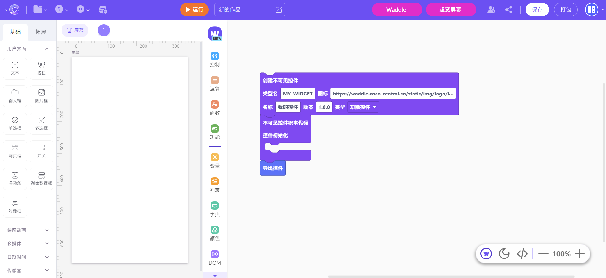

# 油猴插件

使用此插件，你可以直接在CoCo编辑器中，打开内置的Waddle编辑器，更好的实现预览操作，即开即用！

[点击跳转下载页面](https://greasyfork.org/zh-CN/scripts/450313-coco%E4%B8%AD%E6%8E%A7%E5%8F%B0waddle%E5%95%86%E5%9F%8E)

## 插件亮点

### 内置Waddle

快速使用Waddle制作自定义控件并导入，全程方便快捷开发

### 超宽屏幕

超宽屏幕编辑，让您作品实现平板式效果！（需配合自定义控件“Appcraft界面美化”一起使用）

### 自定义控件商城

扩展控件商城，无需官方审核即可上传，快速下载其他人控件。独乐乐不如众乐乐！ 开启后，直接在CoCo编辑器中，找到 扩展->控件商城 即CoCo中控台控件商城！ 还可分享你的作品（非源码），流量倍增

[网页版控件商城](https://storage.bcmcreator.cn/Coco/)
